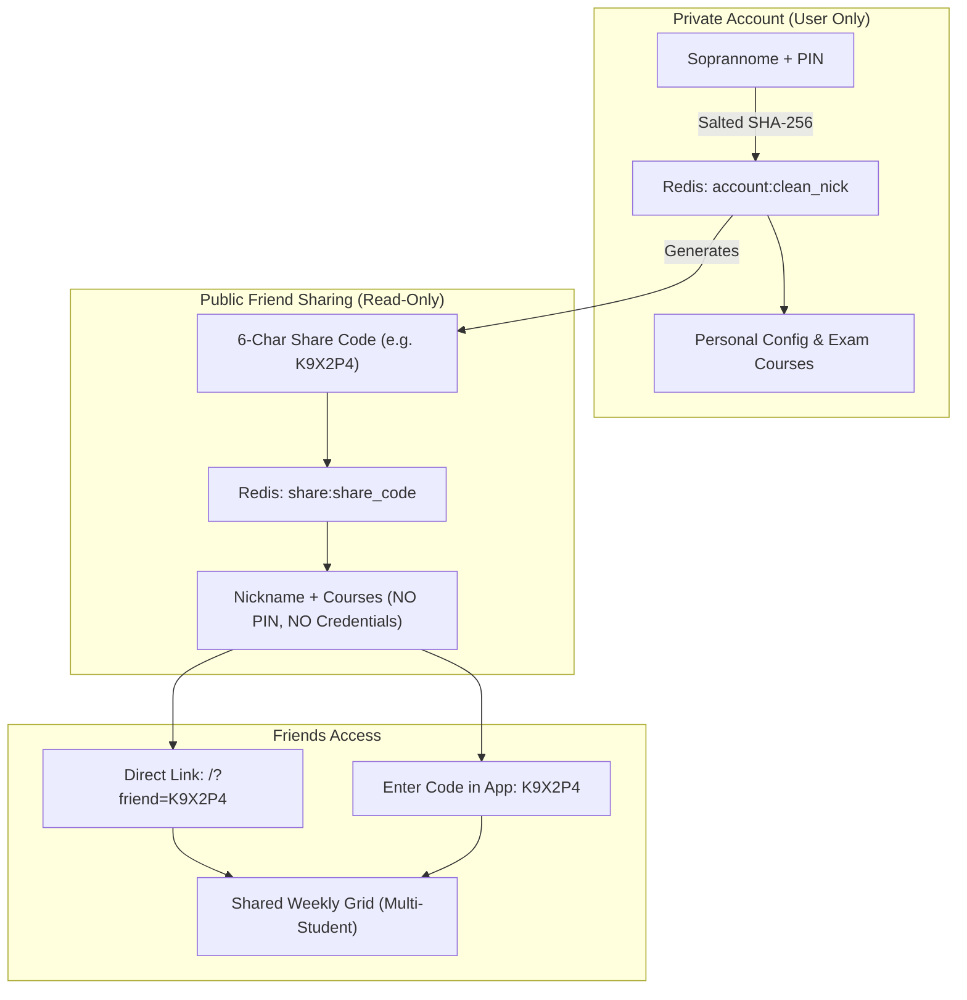

# 📅 UNIMIB Timetable & Campus Companion

A modern, mobile-first Progressive Web App (PWA) designed for students at the **University of Milano-Bicocca (UNIMIB)**. View your weekly lecture timetable, track live classroom occupancy, inspect exam sessions, and share a synchronized schedule with friends.


---

## ✨ Features

### 1. 📅 Lecture Timetable (Orario Lezioni)
- **🎓 Any Degree Programme**: Choose academic year, didactic area, degree course, and study years (e.g. "1 - Percorso comune"). Choices are fetched live from UNIMIB's official EasyCourse system (`combo.php`), automatically supporting new curricula and degree changes.
- **⭐ My Courses Filter (I Miei Corsi)**: Select the specific teachings you attend to get distinct color badges and filter the view to display only your active courses.
- **👆 Mobile Gestures & Daily View**: Swipe or toggle between full weekly overview or day-by-day timetable with automatic current day highlighting.
- **🔍 Real-Time Search**: Instant live filtering by subject name, professor, or classroom.
- **⚠️ Cancellation Notices**: Automatically highlights canceled lectures or last-minute room changes in red.
- **🔗 Share Link & QR Code**: Generate a link or QR code containing your course configuration for instant preview and one-tap import.

### 2. 🏛️ Classroom Occupancy (Occupazione Aule)
- **🏢 All Campus Buildings**: Real-time room status for all 26+ UNIMIB buildings (U01 through U28).
- **🟢 Status at a Glance**: Instant visual badges indicating whether a room is **Libera** (Free) or **Occupata** (Occupied).
- **⏳ Smart Time Windows**: Computes exact availability (*"Libera fino alle 14:30"* or *"Occupata fino alle 16:30"*), automatically chaining consecutive contiguous lectures.
- **⏰ Time Slots & Italian Date Picker**: Check occupancy right now or inspect specific time blocks (09:00, 11:00, 13:00, 14:30, 16:30) for any date in Italian format (`GG/MM/AAAA`).
- **📋 Full Daily Schedule**: Tap any classroom card to open a modal displaying the complete chronological list of lectures and bookings held in that room for the selected day.

### 3. 📝 Exam Calendar (Calendario Esami)
- **🎓 Monitored Courses**: Automatically imports exam dates for your degree and allows adding extra courses from any didactic area across the university.
- **⭐ Personalized Exam Filter**: Switch between **"📚 Tutti gli Appelli"** (all exams for the degree) and **"⭐ I Miei Corsi"** (only exams matching the teachings you actually attend).
- **🗓️ Session Filters**: Quick presets for Winter (*Invernale*), Summer (*Estiva*), Autumn (*Autunnale*), or Custom Date Range.
- **📅 Add to Calendar (.ics)**: Download an `.ics` file for any exam appeal to import it directly into Apple Calendar, Google Calendar, or Outlook.

### 4. 👤 Cloud Profile & Synchronisation (No Complex Passwords)
- **🔑 Memorable Auth (Nickname + PIN)**: No email or password needed. Create an account with your chosen **Soprannome** (e.g. `Mario`) and a 4-8 digit **PIN** (e.g. `1234`).
- **📚 Guided Study Plan Onboarding (2-Step Flow)**: When creating a profile, users are immediately guided to select their degree programme, study year, and active teachings (⭐ I miei corsi). If the student has already picked a course as a guest, a 1-tap instant save option (*"Salva profilo con questo corso"*) is also provided.
- **📱 Multi-Device Sync**: Log in on any device (iPhone, laptop, tablet) simply by entering your Soprannome and PIN. Your study plan, favorite courses, and monitored exams sync automatically.
- **⚡ First-Visit Onboarding**: First-time visitors can choose to create a profile, log in to restore an existing plan, or **Continua come ospite** (Guest mode) to start immediately without registration.
- **☁️ Serverless Storage**: Backed by **Upstash Redis REST API**, salted with SHA-256 for secure PIN verification.

### 5. 👥 Friends Shared Calendar & Synchronized Groups (Gruppi & Calendario Condiviso)
- **🔒 Privacy First (Zero Leaked Credentials)**: Your personal PIN remains strictly private and is only used to log in on your own devices. The system generates an independent, unique 6-character **Codice Calendario Univoco** (e.g. `K9X2P4`) using unambiguous characters (no `0`, `O`, `1`, `I`).
- **🤝 Bidirectional Cloud Group Sync**: When you add a friend via their calendar code (or invite them to a group), **both students are automatically linked to the same cloud group in Redis**. The friend automatically sees your timetable and group members on their own device without needing to manually re-enter your code.
- **🏷️ Unique Group Codes & Links**: Groups receive a persistent group code (e.g. `G7K2P9`) and shareable link (e.g. `/?group=G7K2P9`). Anyone opening the link or entering the code is instantly added to the group for everyone.
- **⭐ Favorites-Only Sharing**: When viewing a friend's schedule, only the subjects they have personally selected (⭐ I miei corsi) are shown — not their entire degree programme. If no favorites are set, all courses are shown as a fallback.
- **👤 Include Yourself**: Toggle **"👤 Includi me"** to overlay your own schedule (filtered to your selected subjects) alongside your friends' timetables, shown in teal with a distinct "Io 👤" badge.
- **🏷️ Merged Shared Courses**: When multiple students in the group attend the same course at the same time, it is displayed as a single consolidated card displaying badges for all attendees (e.g. `[Io 👤] [Mario] [Luca]`), eliminating duplicate cards.
- **📅 Chronological List View**: Toggle **"📋 Elenco"** to browse all group lectures ordered day-by-day and time-by-time.
- **📊 Daily Timeline Grid (08:30 – 18:30)**: Toggle **"📊 Vista Oraria"** to see a vertical time grid for any day of the week. Courses fill their vertical time slots, and different courses overlapping in the same hours are automatically packed side-by-side in parallel lanes with a live indicator for the current time.
- **🟢 Free Slots View (up to 18:30)**: Switch to **"🟢 Slot liberi"** to calculate time windows (≥ 30 min) between 08:30 and 18:30 when **everyone** in the group has no lectures — perfect for finding study breaks, project meetings, or lunch times.
- **⚡ Background Auto-Sync**: The friends group automatically re-synchronizes when the tab becomes active or visible (`visibilitychange`).

### 6. 📱 iOS & Mobile Optimizations
- **Safe Area Inset Support**: Fully accounts for iPhone notch, Dynamic Island, and home indicator bars (`env(safe-area-inset-top)` and `env(safe-area-inset-bottom)`).
- **Compact Header Breakpoints**: Responsive adjustments for narrower screens (e.g. iPhone SE / mini) to keep all navigation buttons accessible.
- **PWA Offline Caching**: Service Worker v12 caches core application assets for fast load times and offline readiness.

---

## 🔒 Privacy & Architecture Model



---

## 🛠️ Tech Stack

- **Frontend**: Vanilla ES6+ JavaScript, Responsive CSS3 (Glassmorphism, Mobile-First, iOS Safe Area support).
- **PWA**: Service Worker cache strategy (`sw.js`) and Web App Manifest (`manifest.json`) for native-like installation on iOS & Android.
- **Backend / Scrapers**: Python serverless functions (standard library `urllib`, `json`, `zoneinfo`, zero external dependencies).
- **Database**: Upstash Redis (Serverless REST API) for profile preferences and friend indices.
- **Hosting & CI/CD**: Vercel Serverless Functions.

---

## 📂 Project Structure

```
.
├── api/
│   ├── calendar.py         # Weekly timetable scraper (grid_call.php)
│   ├── exams.py            # Exam appeals scraper (bookings_call.php)
│   ├── options.py          # Degree dropdown data (combo.php)
│   ├── profile.py          # Profile management & PIN authentication (Upstash Redis)
│   ├── rooms.py            # Live classroom occupancy scraper
│   ├── shared_calendar.py  # Combined multi-student timetable generator
│   └── group.py            # Synchronized cloud study groups & bidirectional friend linking
├── public/
│   ├── css/
│   │   └── style.css       # Responsive dark-theme & glassmorphism styles
│   ├── js/
│   │   ├── app.js          # Main SPA application logic & state management
│   │   └── sw.js           # PWA Service Worker (offline cache v11)
│   ├── icons/              # App icons for iOS / Android home screens
│   ├── index.html          # Single Page Application HTML template
│   └── manifest.json       # Web App Manifest
├── vercel.json             # Vercel serverless rewrites and routing
├── .gitignore
└── README.md
```

---

## 🔌 API Endpoints

| Method | Endpoint | Description |
| :--- | :--- | :--- |
| `GET` | `/api/options` | Returns academic years, didactic areas, degree courses, and study years |
| `GET` | `/api/calendar` | Returns lessons for selected degree course and study years for a given week (`date=DD-MM-YYYY`) |
| `GET` | `/api/rooms` | Returns real-time room occupancy and daily schedule for a campus building (`sede=U01`, `date=DD-MM-YYYY` or `YYYY-MM-DD`, `time=HH:MM`) |
| `GET` | `/api/exams` | Returns upcoming exam appeals filtered by degree courses, years, and date range |
| `POST` | `/api/profile` | Creates a new account (`{ nickname, pin, config, exam_courses }`) and returns generated `share_code` |
| `PUT` | `/api/profile` | Authenticates / updates account (`{ nickname, pin, config?, exam_courses? }`) and syncs cloud schedule |
| `GET` | `/api/profile?code=<CODE>` | Fetches friend's public schedule and nickname using their 6-char share code |
| `GET` | `/api/shared_calendar?codes=C1,C2` | Returns merged weekly timetable for multiple student share codes |
| `GET` | `/api/group?user=<CODE>` or `?id=<GID>` | Fetches cloud group information and all member profiles |
| `POST` | `/api/group` | Manages cloud groups: `add_member`, `sync`, `remove_member`, `join_group`, `rename_group` |

---

## 🧪 Edge Cases & Verification

The backend includes a comprehensive edge case test suite covering:
1. **Accents and Diacritics**: Proper Unicode NFKD normalization (`Nicolò` → `nicolo`, `Élena` → `elena`) ensuring account identifiers are consistent while preserving displayed nicknames.
2. **PIN Validation**: Enforces strictly 4-8 ASCII digits, safely handling leading zeros (`0123`), rejecting non-ASCII digits (`①②③④`), and preventing string/number type errors.
3. **Date Formats**: Accepts both Italian `DD-MM-YYYY` and ISO `YYYY-MM-DD` interchangeably, correctly normalising weekend dates (Saturday/Sunday) to the active academic week's Monday.
4. **Time & Contiguous Bookings**: Accurate Italy timezone calculation (`Europe/Rome` with DST handling) and automatic chaining of back-to-back lectures within 15 minutes.
5. **Exam Multi-Curricula Parsing**: Regex-based splitting supporting both `//` and `/` delimiters across multi-degree exam appeals.
6. **Safe Sorting**: Robust timestamp extraction preventing mixed-type comparison errors (`TypeError: '<' not supported between instances of 'int' and 'str'`).

Run the test suite locally:
```bash
python3 -m unittest scratch/test_edge_cases.py
```

---

## 🚀 Environment Variables (Vercel)

To enable cloud profiles and shared friend calendars, configure the following environment variables in your Vercel project (**Settings** → **Environment Variables**):

| Variable | Description |
| :--- | :--- |
| `UPSTASH_REDIS_REST_URL` | Upstash Redis REST endpoint URL |
| `UPSTASH_REDIS_REST_TOKEN` | Upstash Redis REST bearer token |

---

## 📄 License

This project is open-source and available under the [MIT License](LICENSE).
